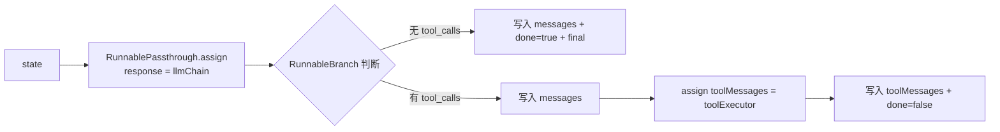
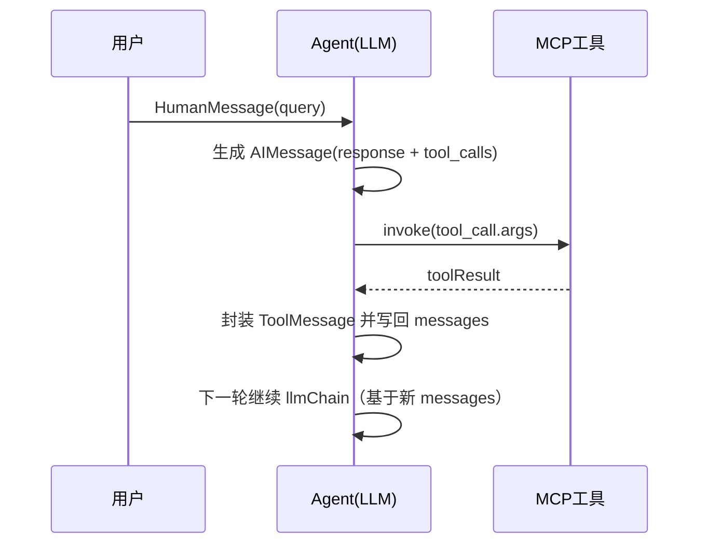

# mcp-test.mjs 执行逻辑说明

本文档对应文件：`runnable-test/src/cases/mcp-test.mjs`

## 一句话概览

这段代码实现了一个基于 LangChain Runnable 的 MCP Agent 循环：**模型先思考，必要时调用工具，将工具结果写回消息历史，再继续思考，直到给出最终答案**。

## 1. 初始化阶段

### 1.1 加载依赖与配置

- 通过 `dotenv/config` 读取环境变量。
- 初始化 `ChatOpenAI`：
  - `modelName: "qwen-plus"`
  - `apiKey: process.env.OPENAI_API_KEY`
  - `baseURL: process.env.OPENAI_BASE_URL`

### 1.2 初始化 MCP 客户端

使用 `MultiServerMCPClient` 注册两个 MCP 服务：

1. `amap-maps-streamableHTTP`
   - URL: `https://mcp.amap.com/mcp?key=${AMAP_MAPS_API_KEY}`
   - 用于地图/酒店等地点信息查询。
2. `chrome-devtools`
   - 通过 `npx -y chrome-devtools-mcp@latest` 启动。
   - 用于浏览器自动化（开标签页、页面操作等）。

### 1.3 获取工具并绑定模型

- `tools = await mcpClient.getTools()`
- `modelWithTools = model.bindTools(tools)`

绑定后，模型可以在回复中产生 `tool_calls`，告知要调用哪个工具及其参数。

## 2. Prompt 与基础链路

### 2.1 Prompt 结构

`ChatPromptTemplate.fromMessages([...])` 包含：

- system 消息：你是可以调用 MCP 工具的助手；
- `MessagesPlaceholder("messages")`：运行时注入当前会话消息历史。

### 2.2 LLM 链

- `llmChain = prompt.pipe(modelWithTools)`

作用：输入 `messages`，输出一条模型回复（可能是普通文本，也可能带 `tool_calls`）。

## 3. 工具执行器（toolExecutor）

`toolExecutor` 是一个 `RunnableLambda`，核心职责是把模型请求的工具真正执行掉：

1. 读取 `response.tool_calls`；
2. 在 `tools` 中匹配同名工具；
3. 执行 `foundTool.invoke(toolCall.args)`；
4. 将工具结果统一字符串化：
   - 若本身是字符串，直接用；
   - 否则优先 `toolResult.text`，再 `JSON.stringify(toolResult)`；
5. 将每个工具结果封装为 `ToolMessage`，并携带 `tool_call_id`；
6. 返回 `toolResults`（`ToolMessage[]`）。

这一步是“模型意图”到“真实工具执行结果”的桥接层。

## 4. 单轮 Agent 步骤（agentStepChain）

`agentStepChain` 使用 `RunnableSequence + RunnableBranch` 定义每轮行为。

### Step 1：先跑模型

通过：

- `RunnablePassthrough.assign({ response: llmChain })`

把当前轮的模型输出挂到 `state.response` 上。

### Step 2：按是否有工具调用分支

#### 分支 A：没有工具调用 -> 本轮完成

条件：

- `!state.response?.tool_calls || state.response.tool_calls.length === 0`

操作：

1. 把 `response` 追加到 `messages`；
2. 设置 `done: true`；
3. 设置 `final: response.content`。

含义：模型已可直接回答，不需调用工具，循环结束。

#### 分支 B：有工具调用 -> 执行工具并继续

默认分支主要做三件事：

1. 先把模型这条含 `tool_calls` 的 `response` 追加到 `messages`；
2. 打印日志（检测到多少工具调用、工具名）；
3. 执行 `toolExecutor`，拿到 `toolMessages`，再写回 `messages`；
4. 设置 `done: false`。

含义：当前轮只完成“调用工具”，下一轮继续让模型基于工具结果再推理。

## 5. 外层循环（runAgentWithTools）

`runAgentWithTools(query, maxIterations = 30)` 是总控循环：

1. 初始化 `state`：
   - `messages = [new HumanMessage(query)]`
   - `done = false`
   - `final = null`
   - `tools`（供执行器使用）
2. 进入最多 30 轮循环：
   - 打印“等待 AI 思考”；
   - 调用 `agentStepChain.invoke(state)` 更新状态；
   - 若 `state.done` 为 `true`：
     - 输出最终结果；
     - `return state.final`
3. 若达到最大轮次仍未完成：
   - 返回最后一条消息内容作为兜底。

## 6. 脚本入口做了什么

实际调用：

- `runAgentWithTools("北京南站附近的酒店，最近的 3 个酒店，拿到酒店图片，打开浏览器，展示每个酒店的图片，每个 tab 一个 url 展示，并且在把那个页面标题改为酒店名")`

预期行为：

1. 借助地图 MCP 工具查附近酒店和图片 URL；
2. 借助 Chrome DevTools MCP 工具打开多个标签页；
3. 每个标签页加载对应图片 URL；
4. 设置页面标题为酒店名；
5. 最终返回文本结果。

## 7. 关键设计特点

- **状态驱动**：所有上下文都通过 `state.messages` 维护。
- **工具回灌**：工具执行结果变成 `ToolMessage` 再喂回模型，形成闭环。
- **分支明确**：无工具调用直接结束；有工具调用则继续迭代。
- **可扩展性好**：新增 MCP 服务后，模型可在同一机制下自动选择调用。

## 8. 可优化建议（可选）

1. 在脚本结束后显式调用 `await mcpClient.close()`，避免资源悬挂（当前代码注释掉了）。
2. 为工具调用增加 `try/catch`，将异常转为可读 `ToolMessage`，避免中断整个循环。
3. 对 `response.content` 做结构兼容（某些模型可能返回数组或多段内容）。
4. 给 `maxIterations` 超限场景增加更明确的告警日志，便于排查。

## 9. 图解版（建议先看这个）

### 9.1 总流程图

```mermaid
flowchart TD
    A[启动脚本] --> B[初始化模型 ChatOpenAI]
    B --> C[初始化 MultiServerMCPClient]
    C --> D[获取 tools 并 bind 到模型]
    D --> E[创建初始 state<br/>messages = HumanMessage(query)]
    E --> F{循环 i < maxIterations}
    F -- 否 --> Z[返回最后一条消息兜底]
    F -- 是 --> G[agentStepChain.invoke(state)]
    G --> H[Step1: llmChain 产出 response]
    H --> I{response 是否包含 tool_calls?}
    I -- 否 --> J[追加 response 到 messages]
    J --> K[done = true, final = response.content]
    K --> L[返回 final]
    I -- 是 --> M[追加 response 到 messages]
    M --> N[toolExecutor 执行每个 tool_call]
    N --> O[得到 ToolMessage 列表]
    O --> P[追加 ToolMessage 到 messages]
    P --> Q[done = false]
    Q --> F
```

### 9.2 单轮内部结构图（agentStepChain）



### 9.3 时序图（一次“有工具调用”的回合）



## 10. 用“白话”再讲一遍

可以把它想成一个会循环的 4 步小工厂：

1. **先问大模型**：你现在要不要用工具？
2. **看结果分流**：
   - 不用工具 -> 直接结束，给最终答案；
   - 要用工具 -> 进入第 3 步。
3. **真正执行工具**：把模型给的参数喂给 MCP 工具，拿回结果。
4. **把结果喂回模型**：让模型继续思考下一步。

然后回到第 1 步，直到模型说“我可以直接回答了”为止。

## 11. 你可以这样观察运行日志

看到下面日志，说明在“工具分支”里：

- `🔍 检测到 X 个工具调用`
- `🔍 工具调用: xxx, yyy`

如果最终出现：

- `✨ AI 最终回复: ...`

说明已经走到了“无工具调用 -> done=true -> return final”的结束分支。

